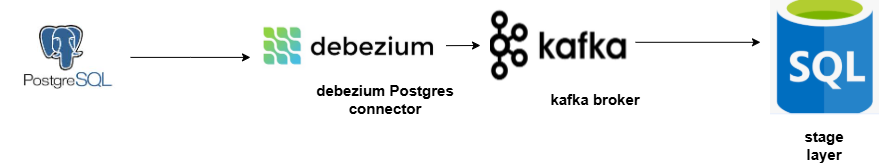

# cdc_using_debezium_and_kafka

A Proof of Concept for CDC pipeline using Debezium and Replica PostgreSQL

## 🧠 Overview

This POC demonstrates:
- [✔] How to set up [components: Debezium with PostgreSQL-primary and replica, Debezium, kafka,  schema-registry, sqlServer as destination]
- [✔] Data flow from source to sql server
- [✔] Execuet Stored Procedure to handle the history changes like scd type 2.

## 🔄 Data Flow



## 🏗 Architecture

Key components:
- **Source DB**: [PostgreSQL Replica Not the Primary]
- **CDC Tool**: [Debezium]
- **Streaming Platform**: [Apache Kafka]
- **Sink Connector**: [JDBC connector to SQL Server]

More details in [architecture.md](architecture.md)

## 🚀 How to Run

1. Clone the repo
2. Go to the setup folder:
   ```bash
   cd setup
   docker-compose up -d
